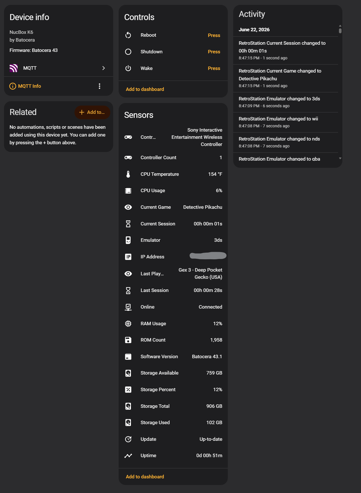

# HA Batocera

Bring Batocera into Home Assistant with real-time MQTT sensors, game tracking, controller monitoring, and system statistics.

HA Batocera is a lightweight Batocera agent that publishes gaming and system data to Home Assistant through MQTT, allowing you to build dashboards, automations, notifications, and statistics around your retro gaming setup.

---

## Features

* Real-time MQTT integration
* Current emulator tracking
* Current and previous game tracking
* Current and previous play session tracking
* Total play time statistics
* Controller connection monitoring
* System uptime monitoring
* CPU usage monitoring
* Memory usage monitoring
* Storage usage monitoring
* Home Assistant friendly MQTT topics
* Lightweight Bash-based implementation
* Designed specifically for Batocera

---

## Requirements

### Batocera

* Batocera Linux
* MQTT client tools (`mosquitto_pub`)
* Network connectivity

### Home Assistant

* Home Assistant
* MQTT Broker
* MQTT Integration

---

## Installation

1. Copy `ha_batocera_agent.sh` to your Batocera system.
2. Configure MQTT settings inside the script.
3. Make the script executable:

```bash
chmod +x ha_batocera_agent.sh
```

4. Start the agent manually or configure it to launch automatically at boot.

---

## Published Data

HA Batocera publishes a variety of MQTT topics including:

### Gaming

* Current Game
* Current Emulator
* Current Session Duration
* Last Played Game
* Previous Session Duration

### Controllers

* Controllers Connected
* Controller Count

### System

* CPU Usage
* Memory Usage
* Storage Usage
* System Uptime

---

## Home Assistant

The published MQTT data can be used to create:

* Dashboard cards
* Statistics
* Automations
* Notifications
* Gaming activity tracking
* Usage reports

---

## Screenshots

<p align="center">
  
</p>

---

## Roadmap

### Version 1.0

* MQTT publishing
* Game tracking
* Emulator tracking
* Controller monitoring
* Session tracking
* System statistics

### Future Releases

* HACS Integration
* Automatic Installer
* Automatic Updates
* MQTT Auto Discovery
* Additional Batocera Sensors
* Multi-System Support

---
## Special Thanks

Special thanks to StePhan McKillen (myle) and the Home Assistant community for helping inspire this project through the original Batocera MQTT discussion:

https://community.home-assistant.io/t/batocera-to-home-assistant-via-mqtt/906675

The community's experimentation with Batocera MQTT events helped demonstrate the possibilities of integrating retro gaming systems with Home Assistant and inspired the creation of HA Batocera.

## License

MIT License
