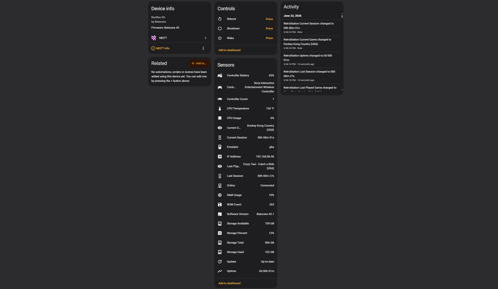

# HA Batocera

Bring Batocera into Home Assistant with real-time MQTT sensors, game tracking, controller monitoring, and system statistics.

HA Batocera is a lightweight Batocera agent that publishes gaming and system data to Home Assistant through MQTT, allowing you to build dashboards, automations, notifications, and statistics around your retro gaming setup.

<p align="center">
   
</p>

## Project Status

### ⚠️ In active development. Features and installation methods may change before v1.0.0.

Current Release: v0.9.0

HA Batocera is currently in pre-release status while the native Home Assistant integration is under development.

The Batocera MQTT Agent is fully functional and suitable for testing and daily use.

## Features

### Gaming

* Current game tracking
* Last played game tracking
* Current emulator tracking
* Current play session tracking
* Previous play session tracking
* Real-time game start and game end detection

### Controllers

* Controller count monitoring
* Connected controller name tracking
* Controller battery monitoring
* Real-time controller connection updates

### System Monitoring

* Online/Offline status monitoring
* CPU temperature monitoring
* CPU usage monitoring
* Memory usage monitoring
* IP address reporting
* System uptime monitoring

### Storage Monitoring

* Storage used
* Storage available
* Total storage capacity
* Storage utilization percentage
* ROM library count

### Software Monitoring

* Batocera version reporting
* Update availability detection

### Home Assistant Integration

* MQTT Discovery support
* Automatic entity creation
* Automatic device registration
* Home Assistant device grouping
* Real-time state updates
* Lightweight Bash-based implementation
* Designed specifically for Batocera Linux

### Remote Control

* Reboot command support
* Shutdown command support
* MQTT-based device control
* Easy integration with Wake-on-LAN, SwitchBot Bot, and Fingerbot power-on solutions through Home Assistant automations
* Wake command trigger (see **Wake Command Trigger Use Cases** below)

## Requirements

### Batocera

* Batocera Linux
* MQTT client tools (`mosquitto_pub`)
* Network connectivity

### Home Assistant

* Home Assistant
* MQTT Broker
* MQTT Integration

## Installation

### 1. Enable SSH in Batocera

On your Batocera system:

1. Open **Main Menu**
2. Select **Network Settings**
3. Enable **SSH**
4. Take note of your Batocera IP address. Example: ```192.168.1.100```


### 2. Connect to Batocera

From another computer on your network:

#### Windows

Open **PowerShell** or **Windows Terminal**.

#### macOS / Linux

Open **Terminal**.

Connect to Batocera device using SSH:

  ```bash
  ssh root@YOUR_BATOCERA_IP_OR_DEVICENAME
  ```
    
  Example:
      
  ```bash
  ssh root@192.168.1.100
  ```
Or

  ```bash
  ssh root@batocera
  ```

When prompted for a password, enter ```linux```. This is Batocera's default SSH password unless you have changed it.


### 3. Create the HA Batocera Directory

Run:

```bash
mkdir -p /userdata/system/homeassistant
```


### 4. Create the Configuration File

Create:
  
  ```bash
  nano /userdata/system/homeassistant/secrets.conf
  ```
  
Copy and Paste the contents of ```batocera_agent/secrets.conf.example``` from this repository
  
Update the MQTT settings for your environment, then save:
  
  ```text
  CTRL + X
  Y
  ENTER
  ```


### 5. Create the Agent Script

Create:

```bash
nano /userdata/system/homeassistant/ha_batocera_agent.sh
```

Copy and paste the contents of ```batocera_agent/ha_batocera_agent.sh``` from this repository.

Save the file:

```text
CTRL + X
Y
ENTER
```


### 6. Make the Agent Executable

```bash
chmod +x /userdata/system/homeassistant/ha_batocera_agent.sh
```


### 7. Start the Agent

```bash
/userdata/system/homeassistant/ha_batocera_agent.sh start
```

After a few seconds, verify that Home Assistant is receiving MQTT data:

1. Open **Home Assistant**
2. Navigate to **Settings → Devices & Services**
3. Select your **MQTT** integration
4. Look for a device named **Batocera** (or whatever you configured as `DEVICE_NAME` in `secrets.conf`)
5. Open the device to confirm that entities are showing up

If the device or entities do not appear, check the MQTT broker logs and verify that your MQTT settings in `secrets.conf` are correct.


### 8. Start Automatically After Reboot

Edit:

```bash
nano /userdata/system/custom.sh
```

Add:

```bash
/userdata/system/homeassistant/ha_batocera_agent.sh start &
```

Save the file:

```text
CTRL + X
Y
ENTER
```

Make it executable:

```bash
chmod +x /userdata/system/custom.sh
```


### 9. Reboot Batocera

```bash
reboot
```

After rebooting, HA Batocera will start automatically.

---

## Updating

When a new version is released, replace:

```text
ha_batocera_agent.sh
```

Your settings stored in ```secrets.conf``` will remain unchanged and do not need to be reconfigured or touched ever again.

More documentation about this process will be provided soon.

## Screenshots

Example Home Assistant dashboard showing HA Batocera sensors and gaming statistics.

Coming Soon

## Wake Command Trigger Use Cases

The Wake button is not intended to power on a completely powered-off Batocera system. For that, you'll need a separate solution such as Wake-on-LAN, a SwitchBot Bot, a Fingerbot, or a similar device.

Instead, the Wake button acts as a reusable Home Assistant automation trigger that can be used to emulate the seamless wake-from-sleep experience found on modern gaming consoles.

### Automation 1 - Define When Batocera is Active
This automation determines when Batocera enters an active state and presses the HA Batocera Wake button. It creates a universal "Batocera In Use" event that can be reused across multiple automations.

**Possible Triggers**

* Controller Count changes from 0 → 1
* A Wake-on-LAN packet is sent
* A physical button, SwitchBot Bot, or Fingerbot is activated
* A voice assistant command is issued
* A scheduled event occurs
* Any other Home Assistant trigger

**Action**

* Press the HA Batocera **Wake** button

### Automation 2 - Define What Happens When Batocera is Active
This automation determines what happens after the Wake button is pressed.

**Trigger**

* HA Batocera **Wake** button pressed

**Possible Actions**

* Turn on the TV (if off)
* Switch to the Batocera HDMI input (if another source is active)
* Turn on a soundbar or AVR (if off)
* Activate gaming lights or RGB effects
* Close blinds or adjust room lighting
* Enable a dedicated gaming scene

Using the two automations in this example:

If the TV and soundbar are off, the automation can power everything on.
If the TV is already on but displaying another source (such as Apple TV), the automation can simply switch to the Batocera input.
If some devices are already on and others are off, the automation can react accordingly.

This approach creates a console-like experience where the same trigger can intelligently adapt to the current state of your entertainment system without requiring changes to the trigger automation itself. By separating the trigger from the scene, users only need to maintain a single "Batocera In Use" automation while customizing the gaming experience however they like.

## Roadmap

### Current Status (v0.9.x)

* MQTT Discovery
* Automatic Home Assistant entity creation
* Automatic device registration
* Game tracking
* Session tracking
* Controller monitoring
* Controller battery monitoring
* System monitoring
* Storage monitoring
* Software version monitoring
* Update detection
* Power management commands

### Planned for v1.0.0

* Native Home Assistant Integration
* HACS Installation Support
* Config Flow
* One-click Installation
* Diagnostics Support
* Automatic Updates

### Future Enhancements

* Dashboard Templates
* Additional Batocera Sensors

## Special Thanks

Special thanks to StePhan McKillen (myle) and the Home Assistant community for helping inspire this project through an MQTT discussion post:

https://community.home-assistant.io/t/batocera-to-home-assistant-via-mqtt/906675

The original discussion demonstrated how MQTT could be used to bridge Batocera and Home Assistant and helped inspire the development of HA Batocera.

## Acknowledgements

- Batocera Linux Team
- Home Assistant Community
- MQTT Community
- Everyone testing and providing feedback for HA Batocera

## License

Released under the MIT License. See the LICENSE file for details.
